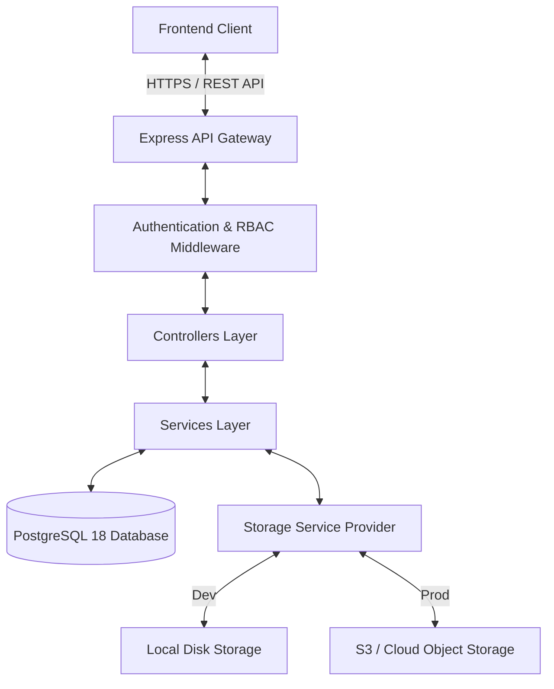
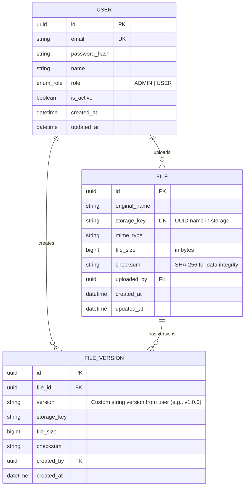

# SSOT Document Management System - Architecture & Implementation Plan

This document details the architectural design, directory structure, database schema, and security recommendations for the **Single Source of Truth (SSOT) Document Management System**. The backend is designed with scalability in mind, using **Node.js, TypeScript, Express, PostgreSQL 18, and Prisma ORM**, making it ready for seamless production scaling.

---

## 1. System Architecture Overview

The system uses a **decoupled Client-Server architecture** (API-first).
* **Frontend**: A modern Single Page Application (SPA), structured but left empty for future development.
* **Backend**: RESTful API in TypeScript, leveraging clean architecture patterns (Routes $\rightarrow$ Controllers $\rightarrow$ Services $\rightarrow$ Data Access).
* **Database**: **PostgreSQL 18** (local container during development, cloud-hosted RDS/managed Postgres for production).
* **File Storage**: Abstracted storage layer using a **Service Interface**. During development, files are saved locally. For production, the code is ready to switch to **Cloud Object Storage (e.g., AWS S3, MinIO, or Google Cloud Storage)** by changing environment variables.



---

## 2. Directory Structure

Below is the directory structure generated for this project.

```text
IT-Dashboard/
├── ARCHITECTURE_PLAN.md            # System planning & design documentation
├── docker-compose.yml              # Local development infrastructure (PostgreSQL 18)
├── backend/
│   ├── .env                        # Environment variables (git-ignored)
│   ├── .env.example                # Example environment variables template
│   ├── package.json                # Project dependencies and scripts
│   ├── tsconfig.json               # TypeScript configuration
│   ├── prisma/
│   │   └── schema.prisma           # Prisma database schema definition
│   └── src/
│       ├── index.ts                # Server entry point
│       ├── app.ts                  # Express application setup
│       ├── config/                 # App configurations (DB, storage, env)
│       │   ├── database.ts
│       │   └── storage.ts
│       ├── controllers/            # Request handlers
│       │   ├── auth.controller.ts
│       │   ├── file.controller.ts
│       │   └── user.controller.ts
│       ├── middlewares/            # Express middlewares (Auth, validation, error handler)
│       │   ├── auth.middleware.ts
│       │   ├── error.middleware.ts
│       │   └── upload.middleware.ts
│       ├── routes/                 # Express API routes definition
│       │   ├── auth.routes.ts
│       │   ├── file.routes.ts
│       │   ├── index.ts
│       │   └── user.routes.ts
│       ├── services/               # Core business logic (Storage, files, users)
│       │   ├── file.service.ts
│       │   ├── storage.service.ts
│       │   └── user.service.ts
│       ├── types/                  # TypeScript interface overrides (e.g. Express Request)
│       │   └── index.d.ts
│       └── utils/                  # Helper utilities (hashing, JWT, formatting)
│           ├── hash.ts
│           ├── jwt.ts
│           └── response.ts
└── frontend/
    └── README.md                   # Placeholder for future frontend work
```

---

## 3. Database Schema (PostgreSQL 18)

The system features two main roles: `ADMIN` and `USER`.
* **USER**: Can view, download, upload, and update files/documents.
* **ADMIN**: Can do everything a user can do, plus manage user accounts (CRUD operations on users).

### Entity-Relationship Diagram (ERD)



---

## 4. Key Security Recommendations & Implementations

### A. Authentication & Session Management
1. **Password Hashing**: Use **argon2** or **bcrypt** with a high cost factor (12 rounds) to protect stored passwords.
2. **Short-Lived JWTs & Refresh Tokens**: Use 15-minute access tokens (JWTs) and longer refresh tokens stored in **HTTP-only, Secure, SameSite=Strict** cookies to protect against Cross-Site Scripting (XSS) and Cross-Site Request Forgery (CSRF).
3. **Rate Limiting**: Protect authentication endpoints (login, register) from brute-force attacks using `express-rate-limit`.

### B. File Upload Security (Critical for Document Management)
1. **Filename Sanitization**: Never store files on disk with their original names (prevents Directory Traversal and code injection). Rename all files to random UUIDs upon storage.
2. **File Type Verification**:
   - Restrict allowed mime types using an **allowlist** (e.g., PDF, DOCX, XLSX, PNG, JPG).
   - Check the magic numbers (file signature) of files instead of relying strictly on file extensions.
3. **Storage Separation**: Store files outside the web server root. In production, utilize private cloud buckets (e.g., S3) and serve them via pre-signed, temporary URLs rather than public endpoints.
4. **Download Headers**: Serve files with `Content-Disposition: attachment` and `X-Content-Type-Options: nosniff` to prevent browsers from executing dangerous content (e.g., hidden HTML/JS scripts) in the context of the domain.

### C. Database Security
1. **Row-Level Security (RLS)**: Enforce security rules directly in the database.
2. **SSL/TLS for Database Connections**: Encrypt database traffic in transit to prevent sniffing.
3. **Environment Isolation**: Never hardcode database credentials. Use `.env` and load them via clean configurations.

### D. General API Security
1. **Helmet**: Use `helmet` middleware to set essential HTTP response security headers.
2. **CORS Configuration**: Restrict CORS to trusted origins only (no wildcard `*` in production).
3. **Input Validation**: Validate every request body, parameter, and query using validation schemas (e.g., `zod` or `joi`) to prevent SQL Injection and command injection.

---

## 5. Deployment & Cloud Preparation (Production Ready)

To ensure this structure is prepared for future production environment outside of `localhost`:
1. **Containerization**: Includes `docker-compose.yml` to run the development environment, making it easy to deploy with Docker Swarm, Kubernetes, or AWS ECS in production.
2. **S3 Storage Provider Integration**: The `StorageService` is designed around an interface. Switching to an S3-compatible service (AWS S3, Google Cloud Storage, DigitalOcean Spaces, or private MinIO) only requires setting the storage type in the environment variables without altering the core controller code.
3. **Database Migration Strategy**: Using **Prisma Migrations** allows database schemas to be tracked in Git and run programmatically in CI/CD pipelines before deployment.
